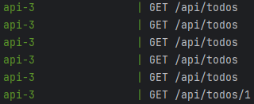
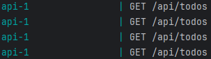
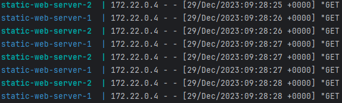

# DAI Labo HTTP Infrastructure

## Static Web server

### Nginx configuration

The nginx configuration is located in the [config](static_web_server/config) folder.
This file configures :

- The number of connections that each worker can handle
- On which port to listen
- The location of the files to use for the Website
- The default file to use for the content
- Custom error pages to create

### Dockerfile

The Dockerfile is located at the root of the [static_web_server](static_web_server) folder.
This file configures:

- Which image it uses `nginx`
- What files to copy from the directory to the container
- Which port to expose for external connection

## API

The API is a simple java application that uses the [Javalin](https://javalin.io/) framework and
[Maven](https://maven.apache.org/) to manage dependencies. This application manages a list of todos and supports all
CRUD operations. The API is located in the [src](api/src) folder.

### Classes

The API is composed of 3 classes :

The `Todo` class is a simple class that represents a todo. It has 2 attributes the name of the task and its status. Note
that there is an empty default constructor to allow the deserialization of the object.

The `TodoController` class is the class that manages the Todos. It has a list of default todos (instead of using a
database) and a method for each CRUD operation. Note that there is also a method `getRoot` that returns a simple text
which is used when we access the root of the API.

The `Api` class is the main class of the application. It creates a new instance of the `TodoController` class and
configures the Javalin server. It also defines the routes for each method of the `TodoController` class.

### Dockerfile

The Dockerfile is located at the root of the [api](api) folder.
This file configures:

- An app builder to automatically build the application
    - Which image it uses 'eclipse-temurin:21' for java 21
    - The working directory '/app'
    - What files to copy to the container (.mvn,mvnw,pom.xml,src)
    - The command to download the dependencies
    - The command to use to build the application
- The app
    - Which image it uses 'eclipse-temurin:21' for java 21
    - The working directory '/app'
    - The .jar file built by the app builder to copy to the container
    - The command to use to execute the .jar file
    - The port to expose for external connection

## Traefik reverse proxy

### Configuration

We added a new service to the [compose.yaml](compose.yaml) file to configure the Traefik reverse proxy. This service uses the official
Traefik image and exposes the ports 80 to access our containers and 8080 to access the Traefik dashboard. Then we added
labels to the static-web-server and api services to configure Traefik. These labels specify the domain name to use for
the service and the port to use to access the service.

```yaml
# static-web-server
labels:
  - traefik.http.routers.static-web-server.rule=Host(`localhost`)
  - traefik.http.services.static-web-server.loadbalancer.server.port=80

...

# api
labels:
  - traefik.http.routers.api.rule=Host(`localhost`) && PathPrefix(`/api`)
  - traefik.http.services.api.loadbalancer.server.port=7000
```

### Why it is useful

The Traefik reverse proxy is useful because it allows us to access the API and the static web server with a single
domain name (which is localhost) and a single port (80). This offers a centralized access point for the whole
infrastructure and allows us to easily add new services to the infrastructure. This makes the infrastructure more
manageable and more secure.

### How the dashboard works

The Traefik reverse proxy also has a dashboard that allows us to see the different services that are running and their
status. This dashboard is accessible at the address `http://localhost:8080`.

## Scalability and load balancing

### Configuration

To allow docker compose to start multiple instances of the containers, we added the `deploy` with the `replicas` option
to the [compose.yaml](compose.yaml) file under the static-web-server and api services. This option allows us to specify the number of
instances of the container to start.

### How to dynamically update the number of instances

To dynamically update the number of instances of the containers, we must first start the infrastructure using :

```shell
docker compose up -d
```

Then we can use this command to update the number of instances of the containers. For example, to start 6 instances of
the static web server and 7 instances of the API :

```shell
docker compose up -d --scale static-web-server=6 --scale api=7
```

## Load balancing with round-robin and sticky sessions

### Configuration

To allow sticky sessions for the api, we simply added these two labels to the [compose.yaml](compose.yaml) file under the api
service :

```yaml
- traefik.http.services.api.loadbalancer.sticky=true
- traefik.http.services.api.loadbalancer.sticky.cookie.name=apicookie
```

These lines specify that the load balancer should use sticky sessions for the api and that the cookie name to use
is `apicookie`.

### How to test

To test the sticky sessions, we can try to access the api multiple times and check that we always get the same instance
of the api. We can see that the terminal always prints the same instance of the api.



We can then try to access the api from another browser or in incognito mode and see that we get another instance.



For the static web server, nothing changed because we didn't add sticky sessions for it. The load balancer still uses
round-robin to balance the load between the instances.



## Securing Traefik with HTTPS

### Certificate generation

To secure Traefik with HTTPS, we first need to generate a certificate. To do this, we used the `openssl` tool. This tool
allows us to generate a self-signed certificate using the private key and the certificate signing request.

```shell
openssl req -x509 -newkey rsa:4096 -keyout key.pem -out cert.pem -sha256 -days 3650 -nodes -subj "/C=XX/ST=StateName/L=CityName/O=CompanyName/OU=CompanySectionName/CN=CommonNameOrHostname"
```

### traefik.yaml

To configure Traefik to use HTTPS, we first need to create a [traefik.yaml](/traefik/traefik.yaml) file. This file configures:

- The provider, which is docker
- The dashboard to be enabled
- The entrypoints to use for the infrastructure
- The certificates to use for HTTPS

## compose.yaml

The [compose.yaml](compose.yaml) configures all the necessary information to be able to use docker compose for our infrastructure:

- The reverse proxy image
    - The image from traefik
    - The local and external ports to use for accessing the image
    - The volumes to be mounted
    - The entrypoint for using HTTPS
    - The usage of TLS
- The static web server image
    - The image to be built
    - The host for which it will handle requests
    - The port to which the load balancer should send data
    - The entrypoint for using HTTPS
    - The usage of TLS
    - The amount to deploy
- The API image
    - The image to be built
    - The host for which it will handle requests
    - The port to which the load balancer should send data
    - The usage of sticky sessions
    - The cookies to use for sticky sessions
    - The entrypoint for using HTTPS
    - The usage of TLS
    - The amount to deploy
- The Portainer image
    - The image from portainer (Community Edition)
    - The command that specifies the Docker socket that Portainer should use to communicate with the Docker daemon on the host
    - Ensures that the "portainer" container restarts automatically if it stops or encounters an issue
    - Specifies the mapping of ports between the host and the container
    - Mounts the Docker socket from the host into the container
    - Creates and mounts a Docker volume named "portainer_data" into the "/data" directory in the container
- Volumes
    - Defines a volume named "portainer_data." This allows the volume to be shared and reused across multiple containers

## Optional steps

### Management UI

To manage our infrastructure, we found a tool called [Portainer](https://www.portainer.io/). This tool allows us to 
manage our docker containers and images. The management UI is accessible at the address `http://localhost:9000`.
To enable Portainer, we added a new service to the [compose.yaml](compose.yaml) file. This service uses the official
Portainer image (Community Edition) and exposes the port 9000 to access the management UI.

### Integration API - static Web site

In the [index.html](static_web_server/content/index.html) file of the static web server, we added a JavaScript script (line 207) that fetches the API every 3
seconds and displays all the fetched todos.
We used the JavaScript `fetch()` API to fetch our Todo API.

The function `getTodos()` fetches the API and converts the received JSON to an array of todos. Then it calls the
function `handleApiData()` which clears a specific HTML container and then adds the HTML code for each todo into it.
